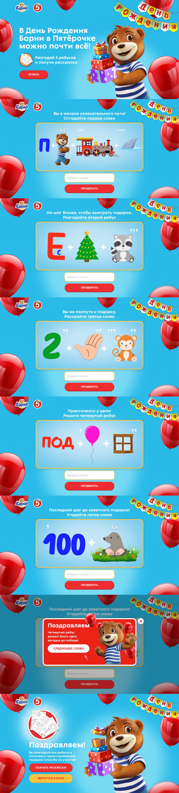

# Barni game page

The task was to develop an interactive quiz based on the Figma prototype design. The user tries to guess the words encrypted in the image step by step
and receives a reward upon completion.

### The correct answers:

- Праздник
- Веселье
- Друзья
- Подарок
- Торт

